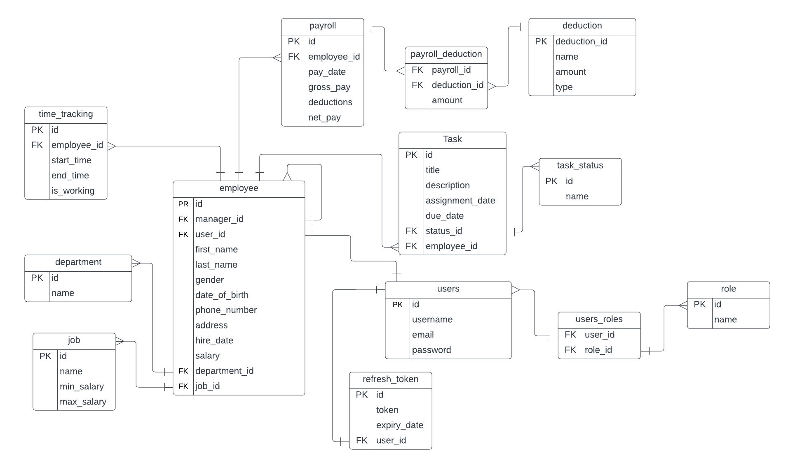

# Employee Management System

This is a demo employee management application, developed with spring boot + react.

## Entity Relationship Diagram



## API Reference

You can access the api docs from: [Swagger API Docs](https://employee-system-vlldc.ondigitalocean.app/swagger-ui/index.html).

JSON Web Token (JWT) is used for authentication and authorization.

#### Login Endpoint

To obtain a JWT, send a POST request to the following endpoint:

```http
  POST /api/auth/login
```

The request body should include the user's credentials in JSON format:

```json
{
    "username": "string",
    "password": "string"
}
```
